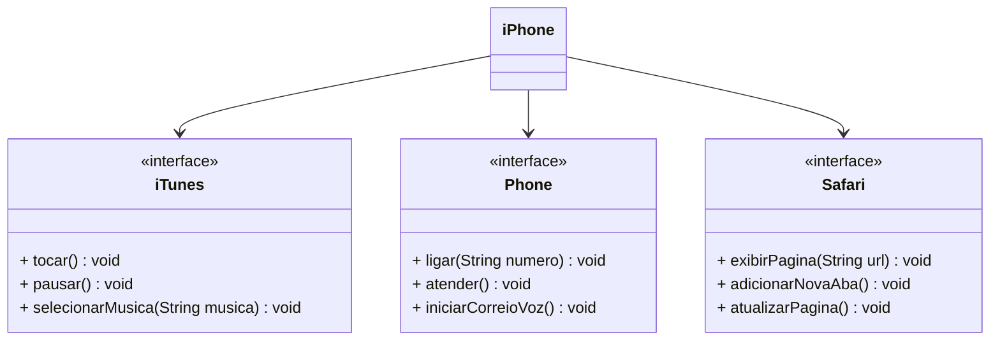

## Desafio - Modelagem e Diagramação de um Componente iPhone
Modelagem e diagramação das classes e interfaces para representar os papéis do componente IPhone, dos quais: Reprodutor Musical, Aparelho Telefônico e Navegador. Juntamente, a implementação das classes e interfaces no formato de arquivo .java.

#### Funcionalidades
1. **Reprodutor Musical - iTune**
   - Métodos: `tocar()`, `pausar()`, `selecionarMusica(String musica)`
2. **Aparelho Telefônico - Phone**
   - Métodos: `ligar(String numero)`, `atender()`, `iniciarCorreioVoz()`
3. **Navegador na Internet - Safari**
   - Métodos: `exibirPagina(String url)`, `adicionarNovaAba()`, `atualizarPagina()`

## Diagrama UML iPhone (Mermaid)

